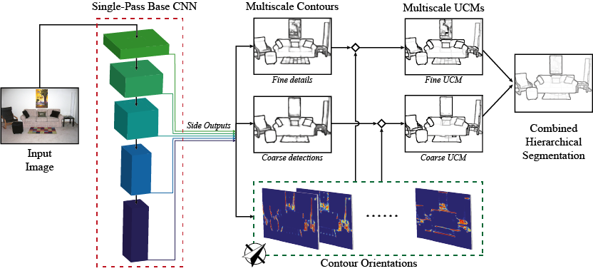

# COB: Convolutional Oriented Boundaries

COB is a technique that produces multiscale oriented contours and region hierarchies from a single forward pass of a generic image classification CNN. The whole pipeline runs in the order of 0.8 seconds per image to produce state-of-the-art hierarchical boundaries.

Check our visit our [project page](http://www.vision.ee.ethz.ch/~cvlsegmentation) for pre-computed results (on `BSDS500`, `PASCAL`, `SBD`, `MS-COCO`, `ImageNet`, etc.), public benchmarks, results visualization, and additional information.

### Prerequisites:
 - Install [this](https://github.com/s9xie/hed) version of Caffe along with standard dependencies and matcaffe.
 - The CNN models of COB to reproduce the results of this paper are available. Download them and put them under `models/`:
  1. Model trained on PASCALContext `train` set (*VOC train*) [Link](https://data.vision.ee.ethz.ch/kmaninis/share/COB/Downloads/COB_PASCALContext_train.zip).
  2. Model trained on PASCALContext `trainval` set (*VOC trainval*) [Link](https://data.vision.ee.ethz.ch/kmaninis/share/COB/Downloads/COB_PASCALContext_trainval.zip).
  3. Model trained on BSDS500 `trainval` set [Link](https://data.vision.ee.ethz.ch/kmaninis/share/COB/Downloads/COB_BSDS500.zip).
  Note: In the paper, we split the original val set of PASCALContext into *VOC val* and *VOC test* sets, while keeping the original training set as is (*VOC train*). *VOC val* was selected not to overlap with SBD val set.

### COB Usage
- To compute COB UCMs, see `im2ucm.m` (and `scripts/im2cob_all.m`)
- To compute COB proposals, see `im2prop.m` (and `scripts/im2cob_all.m`)
- For demos about how to use these functions, see the `demos` folder

For more information on how to use the code, please read `README.txt`
 
### Citation:
If you use this code, please consider citing the following paper:

	@Inproceedings{Man+16a,
	  Title          = {Convolutional Oriented Boundaries},
	  Author         = {K.K. Maninis and J. Pont-Tuset and P. Arbel\'{a}ez and L. Van Gool},
	  Booktitle      = {European Conference on Computer Vision (ECCV)},
	  Year           = {2016}
	}

If you encounter any problems with the code, please contact the first author.

Enjoy!
